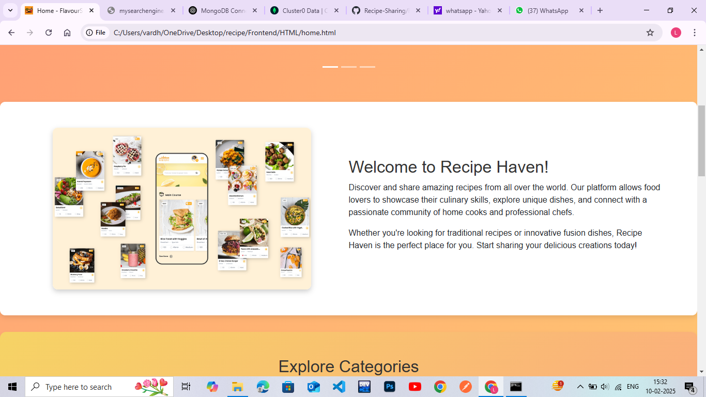
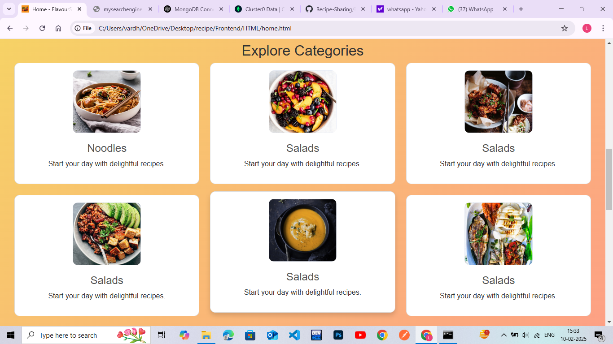
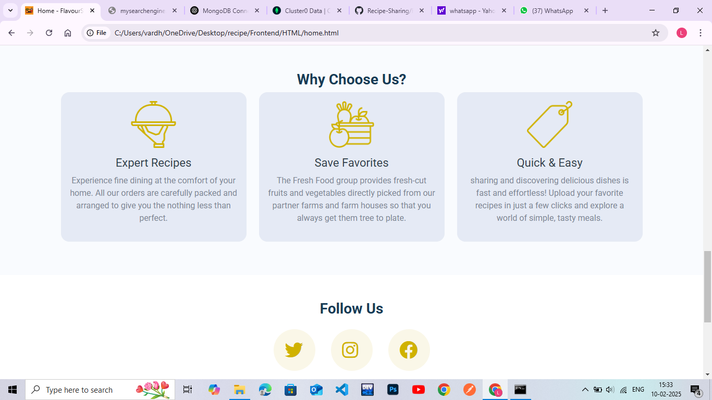

# Recipe-Sharing

Recipe Sharing is a platform for food lovers to share and explore recipes. It provides an organized collection of recipes with easy-to-follow instructions. Users can contribute their own recipes, browse different categories, and try new dishes. Whether you're a beginner or an experienced cook, Recipe Sharing makes cooking fun and accessible for everyone.

## Recipe Collection  

This folder contains a collection of recipes, making it easy to share and access different cooking ideas. Each recipe includes ingredients, step-by-step instructions, and helpful tips.
Users can add the recipes which were cooked by them. This would generate more interactive and curious.  

## Features  
- Easy-to-follow recipes  
- Organized format  
- Variety of cuisines  

## How to Use  
1. Browse the available recipes.  
2. Open any file to view the details.
3. You can register to add recipes.
4. Can add images for better understanding.
5. Try cooking and enjoy!  

To sumup,
This is our Recipe Sharing Project under guidance of MR.SRINIVASU Sir (mentor).

Feel free to contribute by adding new recipes!

